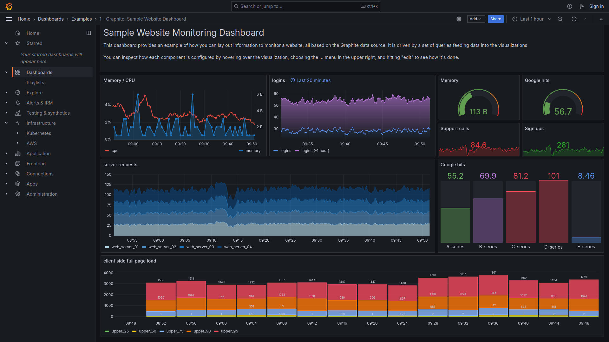

# Coodesh - challenge - clean architecture
API criada para o desafio da [Coodesh](https://coodesh.com/)

## 🚀 Motivaçao / objetivo

Criar uma API para o desafio da [Coodesh](https://coodesh.com/), onde o objetivo é criar uma API. Eu decidi usar clean architecture para desenvolver a API.

## 💻 Requisitos

Antes de iniciar, você deve atualizar (baixar) as dependências do maven.

## 🚀 Instalando

Primeiro, você deve clonar o projeto na sua máquina, para isso você
pode colar o seguinte comando em seu terminal

```bash
git clone https://github.com/Tiago-Silva/coodesh-challenge.git
```
Para instalar as dependências, execute o seguinte comando:

```bash
mvn clean install
```

Por fim, para executar o projeto basta rodar o seguinte:

```bash
o arquvivo MyinterviewApplication.java
```

### Features

Tecnologias usadas nesse projeto:

<!-- Ícones de tecnologias. Você pode encontrar esses ícones em sites como https://simpleicons.org/ -->
<p align="center">
  <a href="https://skillicons.dev">
    
  </a>
</p>

## 📝 Licença

Este projeto está licenciado sob a licença MIT. Consulte o arquivo `LICENSE` para obter mais informações.

# Análisando o relatório
<h1 align="center">
    
</h1>

O gráfico mostra informações de um servidor.
1) Mostra uso de memória e CPU
2) Quantidade de logins nos últimos 20 minutos
3) Quantidade de requests por período de tempo
4) Páginas carregadas completamente pelos clientes ou do lado do cliente

# Um pouco sobre
Sou apaixonado por tecnologia. Já cursei engenharia da computação (dois anos e meio), mas, por motivos pessoais eu tive que trancar o curso. No momento estou cursando engenharia de software